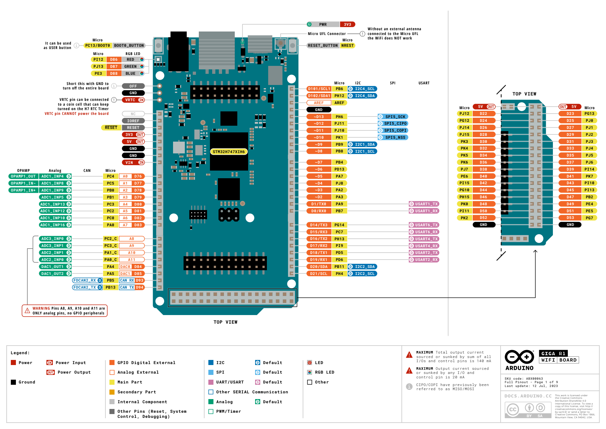

# Sensor unit wiring & bring-up — Arduino GIGA R1 WiFi

Shared wiring rules, the combined pin map and the first-power-on checklist.
**Per-sensor detail (wiring, verification, calibration, assumptions) lives
in [sensors/](sensors/README.md) — one doc per sensor.** Bench sketches:
[`firmware/`](../firmware/README.md).

Scope: wiring + serial bring-up + calibration only. MQTT publishing and the
LVGL screen are the firmware v1 card (#229); cluster-side ingestion is #222.

## Ground rules

- The GIGA is **3.3 V logic and its ADC pins tolerate max 3.3 V**. Every
  sensor here runs off the **3V3 pin** — nothing connects to 5 V.
- External sensors use the main **`Wire`** bus (the dedicated SDA/SCL header
  pins, same bus as D20/D21). The Display Shield's own peripherals (GT911
  touch, BMI270 IMU) sit on `Wire1`, so they never clash with our sensors.
- The Display Shield mounts on the underside of the GIGA; the pin headers
  stay accessible.
- All electronics boards stay dry above the waterline; only probes designed
  for immersion go in the tank.

## Pin map

| Sensor | Interface | GIGA connection | Address | Doc |
|---|---|---|---|---|
| CQRSENYW003 level probe | frequency (open collector) | **D3** (internal pull-up) | — | [sensors/level-probe.md](sensors/level-probe.md) |
| Grove water level 10 cm (optional) | I²C | SDA/SCL header pins | 0x77 + 0x78 | [sensors/level-strip.md](sensors/level-strip.md) |
| DS18B20 (water temp) | 1-Wire | **D2**, 4.7 kΩ pull-up to 3V3 | — | [sensors/water-temp.md](sensors/water-temp.md) |
| Grove TDS (EC) | analog | **A0** | — | [sensors/ec-tds.md](sensors/ec-tds.md) |
| pH — SEN0169-V2 via DFR0504 | analog | **A1** | — | [sensors/ph.md](sensors/ph.md) |
| BME280 (air T/RH/P) | I²C | SDA/SCL header pins | **0x76 — strap required!** | [sensors/air-bme280.md](sensors/air-bme280.md) |
| BH1750 (light) | I²C | QT daisy-chain off the BME280 | 0x23 | [sensors/light-bh1750.md](sensors/light-bh1750.md) |
| Fibaro Wall Plug (pump watts) | Z-Wave → Home Assistant | — (nothing on the GIGA) | — | [sensors/pump-power.md](sensors/pump-power.md) |

I²C address map after strapping: `0x23` BH1750 · `0x76` BME280 · `0x77` +
`0x78` level strip. No conflicts — but the ⚠ **BME280 SDO strap to 0x76**
must happen BEFORE first power-on
([why](sensors/air-bme280.md#-address-strap-before-first-power-on)).

## Cable color conventions

- **STEMMA QT** (BME280 → BH1750 chain, QT→male-dupont to the header):
  black = GND, red = 3V3, **blue = SDA, yellow = SCL**.
- **Grove** (both Grove sensors, Grove→male-jumper cables):
  black = GND, red = VCC (**wire to 3V3**), yellow = pin 1 (SCL on I²C /
  signal on analog), white = pin 2 (SDA on I²C / NC on analog).
- **Gravity analog** (pH chain): black = GND, red = VCC, blue = signal.

## First power-on checklist

1. Wire everything **except** the pH transmitter's probe (leave the BNC
   capped); flash `firmware/bringup`, open serial at 115200 baud.
2. Boot I²C scan must report exactly **0x23, 0x76, 0x77, 0x78** (fewer if
   a sensor is deliberately absent).
   - Missing 0x76 → BME280 strap, or QT chain power.
   - Missing 0x77/0x78 → Grove level cable (yellow=SCL/white=SDA swapped is
     the classic mistake).
3. Sanity-check each reading — the quick checks live in each sensor's doc
   under [sensors/](sensors/README.md) (breathe on the BME280, cover the
   BH1750, warm the DS18B20, dip the level probe, buffer/fluid tests for
   pH and EC).
4. Only then move probes to the reservoir.

## GIGA R1 WiFi board reference

Full official pinout (all 9 pages, incl. the high-density connectors):
[images/giga-r1-wifi-full-pinout.pdf](images/giga-r1-wifi-full-pinout.pdf)
(from [docs.arduino.cc](https://docs.arduino.cc/hardware/giga-r1-wifi/)).
Product page: [store.arduino.cc/products/giga-r1-wifi](https://store.arduino.cc/products/giga-r1-wifi) ·
[datasheet (PDF)](https://docs.arduino.cc/resources/datasheets/ABX00063-datasheet.pdf).

Notes worth knowing from the pinout sheet:
- **A8–A11 are analog-only** (no GPIO peripherals) — fine for us, our
  analog sensors sit on A0/A1.
- Current limits: **140 mA total** across all I/O and control pins,
  **20 mA per pin** — the level probe's ~80 mA comes from the 3V3 *power*
  rail, not an I/O pin, so it doesn't count against this.
- **WiFi needs the external antenna on the Micro UFL connector** — without
  it there is no WiFi. Matters for #229 (MQTT) and #243 (OTA).

## Bring-up status

See the status column in [sensors/README.md](sensors/README.md) — as of
2026-08-25 the CQRSENYW003 level probe is wired + calibrated and the
DS18B20 is verified; the rest is pending wiring or purchases.
